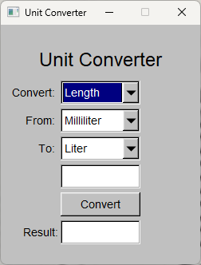

## Usage

1. Select the type of conversion (Length or Volume)
2. Choose the source unit from the "From" dropdown
3. Choose the target unit from the "To" dropdown
4. Enter the value to convert in the input field
5. Click "Convert" to see the result

## Screenshot

## License

This project is licensed under the GPLv3 License - see the [LICENSE](LICENSE) file for details.

## Acknowledgments

- FLTK team for the excellent GUI library